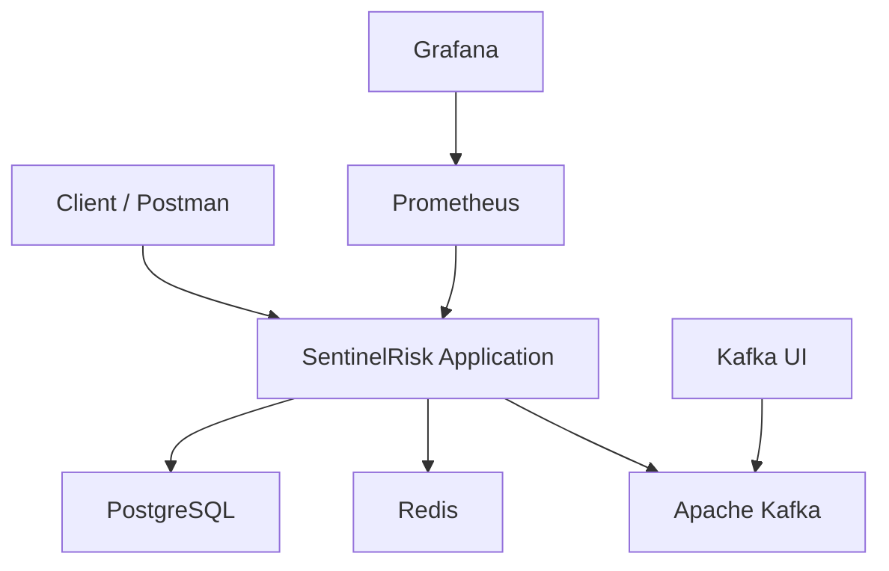
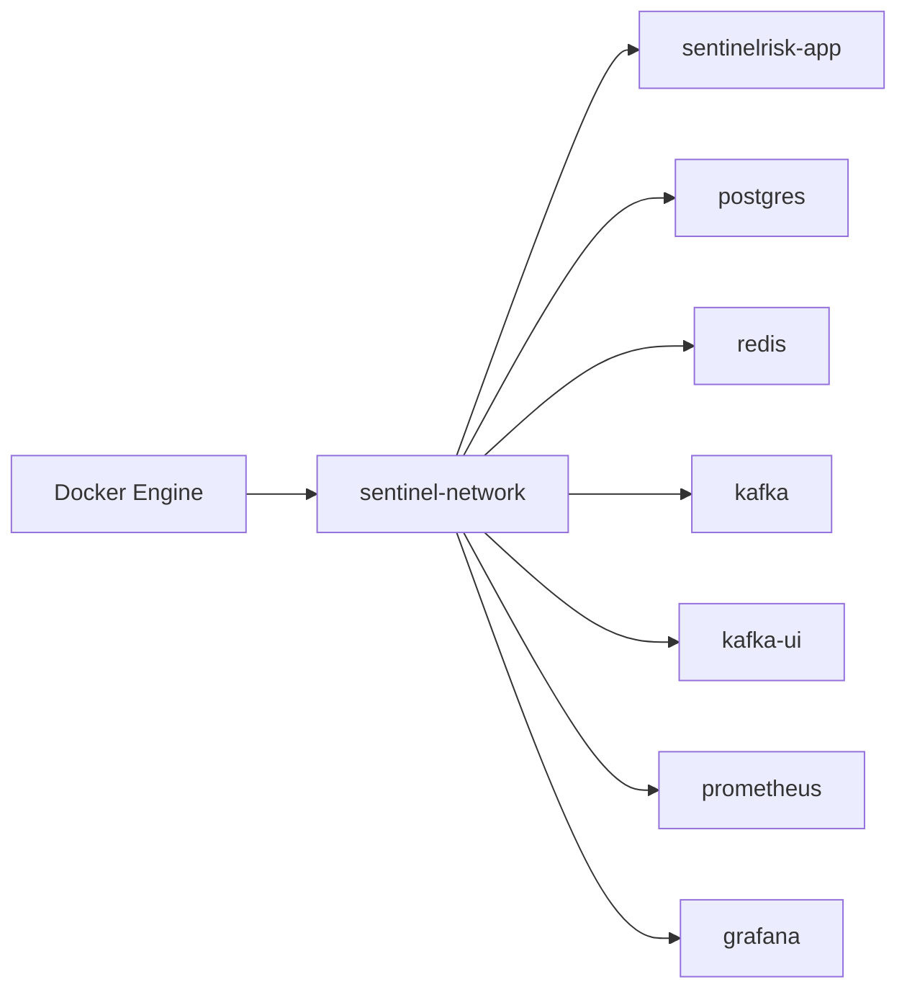
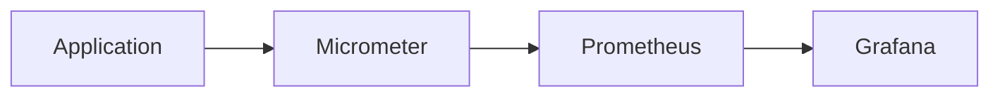
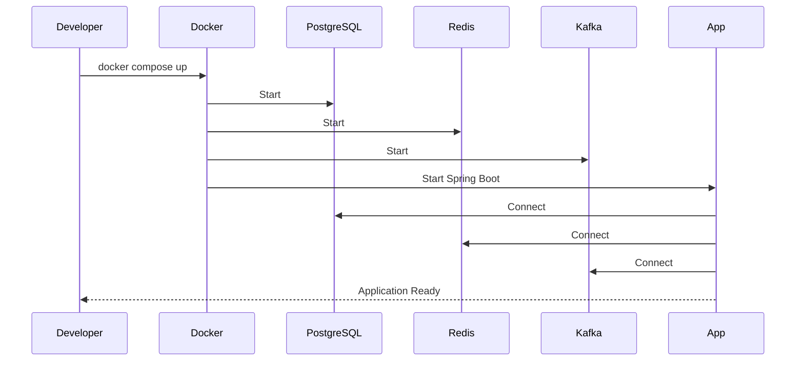

# Deployment Architecture

> **Project:** SentinelRisk – Payment Risk Assessment & Fraud Detection Engine
> **Version:** 1.0
> **Deployment:** Docker Compose (Development)
> **Cloud Ready:** Kubernetes (Future)

---

# Table of Contents

1. Overview
2. Deployment Architecture
3. Infrastructure Components
4. Container Architecture
5. Docker Network
6. Port Configuration
7. Environment Variables
8. Health Checks
9. Logging & Monitoring
10. Startup Sequence
11. Deployment Flow
12. Production Considerations

---

# 1. Overview

SentinelRisk is deployed as a containerized application using Docker Compose for local development. The deployment is designed to closely resemble a production environment by including the supporting infrastructure required for a fintech backend service.

The architecture includes:

* SentinelRisk Application
* PostgreSQL
* Redis
* Apache Kafka (KRaft Mode)
* Kafka UI
* Prometheus
* Grafana

---

# 2. Deployment Architecture



---

# 3. Infrastructure Components

| Component    | Purpose                                       |
| ------------ | --------------------------------------------- |
| SentinelRisk | Main Spring Boot application                  |
| PostgreSQL   | Persistent data storage                       |
| Redis        | Cache, duplicate detection, velocity tracking |
| Apache Kafka | Event streaming                               |
| Kafka UI     | Kafka topic inspection                        |
| Prometheus   | Metrics collection                            |
| Grafana      | Metrics visualization                         |

---

# 4. Container Architecture



All containers communicate through the same Docker bridge network.

---

# 5. Docker Network

Network Name

```text
sentinel-network
```

Benefits:

* Service discovery by container name
* Internal communication
* Isolated environment
* Easy scaling

Example:

```text
spring.datasource.url=jdbc:postgresql://postgres:5432/sentinelrisk
spring.data.redis.host=redis
spring.kafka.bootstrap-servers=kafka:9092
```

---

# 6. Port Configuration

| Service      | Internal | External |
| ------------ | -------- | -------- |
| SentinelRisk | 8080     | 8080     |
| PostgreSQL   | 5432     | 5432     |
| Redis        | 6379     | 6379     |
| Kafka        | 9092     | 9092     |
| Kafka UI     | 8080     | 8081     |
| Prometheus   | 9090     | 9090     |
| Grafana      | 3000     | 3000     |

---

# 7. Environment Variables

Sensitive configuration is externalized.

Example:

```properties
SPRING_DATASOURCE_URL=jdbc:postgresql://postgres:5432/sentinelrisk
SPRING_DATASOURCE_USERNAME=postgres
SPRING_DATASOURCE_PASSWORD=postgres

SPRING_DATA_REDIS_HOST=redis
SPRING_DATA_REDIS_PORT=6379

SPRING_KAFKA_BOOTSTRAP_SERVERS=kafka:9092

JWT_SECRET=<YOUR_SECRET_KEY>
JWT_ACCESS_TOKEN_EXPIRY=900
JWT_REFRESH_TOKEN_EXPIRY=604800
```

Never commit secrets to Git.

Use:

* `.env`
* `.env.example`
* Docker environment variables

---

# 8. Health Checks

The application exposes Spring Boot Actuator endpoints.

| Endpoint               | Purpose                       |
| ---------------------- | ----------------------------- |
| `/actuator/health`     | Overall application health    |
| `/actuator/info`       | Build and version information |
| `/actuator/prometheus` | Metrics for Prometheus        |

Docker Compose should use health checks before starting dependent services.

---

# 9. Logging & Monitoring

### Logging

* Structured JSON logs
* Correlation ID
* Trace ID
* Request execution time

### Monitoring



Collected Metrics:

* HTTP Requests
* JVM Memory
* CPU Usage
* Kafka Publish Count
* Redis Hit Ratio
* Database Connections

---

# 10. Startup Sequence

The containers should start in the following order:

```text
1. PostgreSQL
2. Redis
3. Kafka
4. Kafka UI
5. Prometheus
6. SentinelRisk Application
7. Grafana
```

The application should wait until PostgreSQL, Redis, and Kafka are healthy before accepting requests.

---

# 11. Deployment Flow



---

# 12. Production Considerations

The local Docker Compose deployment is intended for development only.

For production, the architecture should evolve to include:

* Kubernetes Deployment
* Horizontal Pod Autoscaler
* PostgreSQL Managed Service
* Redis Cluster
* Kafka Cluster
* External Secret Manager
* HTTPS with TLS
* CI/CD Pipeline
* Centralized Logging (ELK/OpenSearch)
* Backup & Disaster Recovery

---

# Deployment Summary

| Area                | Technology           |
| ------------------- | -------------------- |
| Containerization    | Docker               |
| Orchestration (Dev) | Docker Compose       |
| Database            | PostgreSQL           |
| Cache               | Redis                |
| Messaging           | Apache Kafka         |
| Monitoring          | Prometheus + Grafana |
| Logging             | Logback + JSON Logs  |
| Health Checks       | Spring Boot Actuator |

---

# Key Design Decisions

* Docker Compose provides a production-like local environment.
* All infrastructure services run in isolated containers.
* Environment variables are used for configuration.
* Health checks prevent the application from starting before dependencies are ready.
* Monitoring and observability are included from the beginning rather than added later.

---

# Future Enhancements

* Kubernetes Deployment
* Helm Charts
* GitHub Actions CI/CD
* Blue-Green Deployment
* Rolling Updates
* OpenTelemetry Distributed Tracing
* Managed Cloud Infrastructure (AWS/GCP/Azure)
