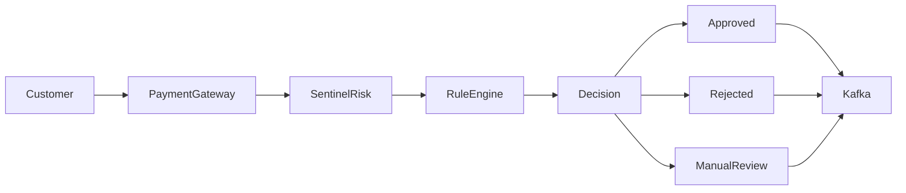

# Business Requirements Document (BRD)

> Project: SentinelRisk
>
> Version: 1.0
>
> Status: Draft
>
> Owner: Rohan Badgujar
>
> Last Updated: June 2026

---

# Table of Contents

1. Introduction
2. Business Context
3. Existing Challenges
4. Proposed Solution
5. Business Objectives
6. Stakeholders
7. Business Capabilities
8. Functional Scope
9. Business Constraints
10. Assumptions
11. Success Criteria
12. Risks
13. Future Vision

---

# 1. Introduction

The financial services industry processes billions of payment transactions daily. With the rapid growth of digital payments, organizations face increasing risks related to fraud, duplicate transactions, bot attacks, account compromise, and regulatory compliance.

SentinelRisk is designed as a dedicated Risk Assessment Service that evaluates every payment request before authorization. Instead of processing payments directly, the system analyzes incoming transactions using configurable fraud detection rules and returns an approval, rejection, or manual review decision.

This document defines the business requirements and objectives that guide the development of SentinelRisk.

---

# 2. Business Context

Traditional payment systems rely on static validations that are insufficient against modern fraud techniques. Fraudsters continuously evolve their methods, requiring payment platforms to perform real-time risk analysis before approving financial transactions.

A dedicated risk engine provides:

- Centralized fraud evaluation
- Configurable business rules
- Consistent decision-making
- Improved customer trust
- Reduced financial losses
- Regulatory auditability

---

# 3. Existing Challenges

Organizations commonly encounter the following issues:

| Challenge | Impact |
|------------|--------|
| Duplicate payment requests | Financial loss |
| High-value fraudulent transactions | Revenue leakage |
| Bot-generated payment attempts | Increased infrastructure cost |
| Lack of centralized fraud rules | Inconsistent decisions |
| Manual fraud investigation | Operational overhead |
| Limited transaction visibility | Poor monitoring |
| Slow fraud detection | Increased exposure |

---

# 4. Proposed Solution

SentinelRisk introduces a centralized backend service responsible for evaluating payment requests in real time.

The service receives transaction details, applies configurable fraud detection rules, evaluates contextual information, and generates a risk decision.

Possible outcomes include:

- APPROVED
- REJECTED
- MANUAL_REVIEW

The system publishes evaluation events to Kafka, enabling downstream services such as analytics, monitoring, and notification systems.

---

# 5. Business Objectives

Primary objectives:

- Minimize fraudulent transactions
- Improve payment approval accuracy
- Reduce operational costs
- Enable real-time fraud detection
- Centralize business rules
- Improve auditability
- Support future AI-based fraud detection
- Increase merchant confidence

---

# 6. Stakeholders

| Stakeholder | Responsibility |
|--------------|----------------|
| Merchant | Initiates payment requests |
| Customer | Performs payment |
| Risk Analyst | Reviews flagged transactions |
| Fraud Operations Team | Investigates suspicious activity |
| Backend Engineering | Builds and maintains SentinelRisk |
| DevOps Team | Deploys and monitors infrastructure |
| Security Team | Reviews compliance and security |
| Product Manager | Defines business rules |

---

# 7. Business Capabilities

SentinelRisk provides the following capabilities:

## Transaction Evaluation

Analyze payment requests before authorization.

---

## Rule-Based Decision Engine

Execute configurable fraud detection rules.

---

## Velocity Monitoring

Detect abnormal transaction frequency.

---

## Blacklist Verification

Validate users, merchants, devices, and IP addresses.

---

## Audit Logging

Maintain immutable records for every evaluation.

---

## Event Publishing

Publish risk evaluation events for downstream consumers.

---

## Operational Monitoring

Expose metrics and health information.

---

# 8. Functional Scope

The first version of SentinelRisk includes:

✔ REST APIs

✔ JWT Authentication

✔ Merchant Validation

✔ Device Validation

✔ Velocity Checks

✔ Redis Caching

✔ Fraud Rule Engine

✔ Kafka Integration

✔ PostgreSQL Persistence

✔ Audit Logging

✔ Metrics

✔ Health Checks

✔ Docker Deployment

---

# 9. Business Constraints

The system must satisfy the following constraints:

- Risk evaluation must complete within 150 milliseconds under normal load.
- All requests must be authenticated.
- Personally identifiable information (PII) must be encrypted.
- Sensitive data must never appear in logs.
- Every decision must be traceable.
- Rule execution must be deterministic.

---

# 10. Assumptions

The following assumptions apply:

- Payment gateway performs authentication before forwarding requests.
- Merchant onboarding is handled by another service.
- Customer identity is already verified.
- Transaction data is trustworthy.
- Kafka infrastructure is available.
- Redis operates as a distributed cache.
- PostgreSQL serves as the primary relational database.

---

# 11. Success Criteria

The project is considered successful if it achieves:

- Reduction in fraudulent payment approvals
- Stable API response time below target SLA
- High service availability
- Complete auditability
- Secure authentication
- Comprehensive monitoring
- Clean architecture
- Production-ready deployment

---

# 12. Risks

| Risk | Mitigation |
|------|------------|
| Redis outage | Fallback to database |
| Kafka unavailable | Retry with backoff |
| PostgreSQL downtime | Health checks and failover |
| Incorrect fraud rules | Rule versioning and testing |
| High traffic spikes | Horizontal scaling |
| Sensitive data exposure | Encryption and masking |

---

# 13. Future Vision

The long-term vision for SentinelRisk includes:

### Machine Learning Integration

Replace static rules with adaptive fraud detection models.

### Dynamic Rule Management

Allow fraud analysts to configure rules without code changes.

### Multi-Region Deployment

Support geographically distributed deployments.

### Event Sourcing

Maintain immutable event history for every decision.

### CQRS

Separate read and write models for improved scalability.

### Risk Dashboard

Provide real-time fraud monitoring and analytics.

### Device Fingerprinting

Improve fraud detection accuracy using behavioral analysis.

---

# Business Workflow

---

# Acceptance Criteria

A payment request is considered successfully evaluated when:

- Authentication succeeds.
- Request validation succeeds.
- Fraud rules execute successfully.
- Risk decision is generated.
- Audit information is persisted.
- Kafka event is published.
- Response is returned within SLA.

---

# Key Business KPIs

| KPI | Target |
|------|---------|
| API Availability | 99.9% |
| Average Response Time | <150ms |
| Risk Evaluation Time | <100ms |
| Fraud Detection Accuracy | Configurable |
| Failed Evaluations | <0.1% |
| Kafka Publish Success | >99.9% |

---

# Conclusion

SentinelRisk serves as the central decision-making component responsible for protecting payment systems from fraudulent activity. By combining rule-based evaluation, event-driven communication, secure architecture, and operational observability, the platform establishes a scalable foundation for enterprise-grade risk assessment in modern fintech ecosystems.