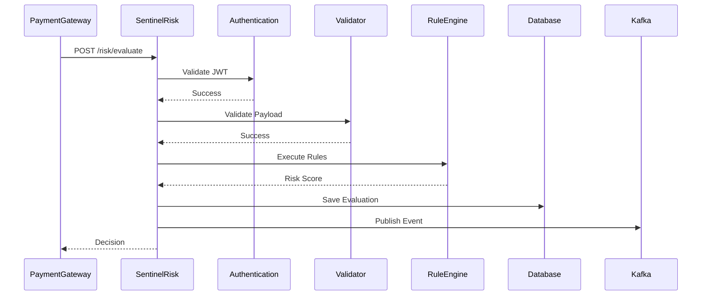

# Functional Requirements Specification (FRS)

> Project: SentinelRisk  
> Version: 1.0  
> Status: Draft  
> Document Owner: Backend Engineering Team  
> Last Updated: June 2026

---

# Table of Contents

1. Introduction
2. Purpose
3. System Overview
4. Actors
5. Functional Modules
6. Functional Requirements
7. User Stories
8. Business Rules
9. Validation Rules
10. API Functional Flow
11. State Management
12. Error Handling
13. Audit Requirements
14. Logging Requirements
15. Event Publishing
16. Performance Requirements
17. Acceptance Criteria

---

# 1. Introduction

This document defines the functional requirements for SentinelRisk.

The purpose of this document is to provide a complete specification of system behavior from the perspective of business functionality.

It acts as the contract between Product, Engineering, QA, and DevOps teams.

---

# 2. Purpose

SentinelRisk evaluates payment requests before authorization and returns one of the following decisions:

• APPROVED
• REJECTED
• MANUAL_REVIEW

The service applies configurable fraud detection rules while ensuring security, scalability, and auditability.

---

# 3. System Overview

```text
                Payment Request

                      │

                      ▼

              Authentication

                      ▼

             Request Validation

                      ▼

          Fraud Rule Evaluation

                      ▼

        Risk Score Calculation

                      ▼

           Decision Generation

                      ▼

       Store Evaluation Result

                      ▼

         Publish Kafka Event

                      ▼

            Return Response
```

---

# 4. Actors

## Customer

Initiates payment.

---

## Merchant

Receives payment.

---

## Payment Gateway

Calls SentinelRisk.

---

## Risk Analyst

Reviews suspicious transactions.

---

## System Administrator

Configures fraud rules.

---

# 5. Functional Modules

The system consists of the following modules.

| Module | Responsibility |
|----------|----------------|
| Authentication | Authenticate APIs |
| Merchant Module | Merchant Validation |
| Rule Engine | Execute Fraud Rules |
| Velocity Checker | Detect abnormal activity |
| Blacklist Service | Check blacklist |
| Risk Evaluator | Calculate Risk Score |
| Kafka Publisher | Publish events |
| Audit Service | Persist evaluation |
| Monitoring | Metrics |

---

# 6. Functional Requirements

## FR-001

Authenticate every incoming request.

Priority

Critical

Input

JWT Access Token

Output

Authenticated Principal

Failure

401 Unauthorized

---

## FR-002

Validate request payload.

Required Fields

- Merchant ID
- Customer ID
- Transaction ID
- Amount
- Currency
- Device ID
- IP Address

Invalid payloads must return HTTP 400.

---

## FR-003

Validate Merchant.

Checks

- Merchant Exists
- Merchant Active
- Merchant Not Blocked

Failure

Merchant Validation Failed

---

## FR-004

Check Blacklist.

Entities

- Customer
- Merchant
- Device
- IP Address

If blacklisted

Decision = REJECTED

---

## FR-005

Velocity Check

Example Rules

5 payments within 60 seconds

↓

MANUAL_REVIEW

10 payments within 60 seconds

↓

REJECTED

---

## FR-006

High Amount Rule

If

Amount > Configured Threshold

↓

Increase Risk Score

---

## FR-007

Country Validation

If

Transaction Country

!=

Registered Merchant Country

↓

Increase Risk Score

---

## FR-008

Duplicate Transaction Detection

Transaction ID already processed

↓

Reject Request

---

## FR-009

Calculate Risk Score

Risk Score Range

0–100

Decision Matrix

| Score | Decision |
|--------|-----------|
| 0–39 | APPROVED |
| 40–69 | MANUAL_REVIEW |
| 70–100 | REJECTED |

---

## FR-010

Persist Evaluation Result.

Store

- Request
- Decision
- Rule Results
- Timestamp
- Correlation ID

---

## FR-011

Publish Kafka Event

Topic

risk.evaluated

Payload

RiskEvaluationEvent

---

## FR-012

Return Response

Example

```json
{
  "transactionId":"TXN123",
  "decision":"APPROVED",
  "riskScore":22,
  "message":"Transaction approved"
}
```

---

# 7. User Stories

## US-001

As a Payment Gateway

I want to submit a payment request

So that the system evaluates fraud risk.

---

## US-002

As a Risk Analyst

I want every decision stored

So that suspicious transactions can be investigated.

---

## US-003

As an Administrator

I want fraud rules configurable

So that business policies evolve without major code changes.

---

## US-004

As a Merchant

I want fast responses

So customers experience minimal payment latency.

---

# 8. Business Rules

BR-001

Inactive Merchant

↓

Reject

---

BR-002

Blacklisted Device

↓

Reject

---

BR-003

Velocity Threshold Exceeded

↓

Manual Review

---

BR-004

Risk Score ≥70

↓

Reject

---

BR-005

Risk Score <40

↓

Approve

---

# 9. Validation Rules

Merchant ID

Must not be null

---

Amount

Greater than zero

---

Currency

ISO-4217 format

---

Transaction ID

Unique

---

Customer ID

Required

---

Device ID

Required

---

IP Address

Valid IPv4 or IPv6

---

# 10. API Functional Flow



---

# 11. State Management

Evaluation States

```text
RECEIVED

↓

VALIDATED

↓

PROCESSING

↓

RULE_EXECUTION

↓

COMPLETED
```

Failure States

```text
AUTH_FAILED

VALIDATION_FAILED

SYSTEM_ERROR
```

---

# 12. Error Handling

| Error | HTTP Status |
|----------|------------|
| Invalid JWT | 401 |
| Invalid Request | 400 |
| Merchant Not Found | 404 |
| Duplicate Transaction | 409 |
| Internal Error | 500 |

---

# 13. Audit Requirements

Every request must generate an audit record containing:

- Transaction ID
- Merchant ID
- Decision
- Risk Score
- Timestamp
- Correlation ID
- Rules Triggered

Audit data must be immutable.

---

# 14. Logging Requirements

Every request must log:

- Trace ID
- Correlation ID
- Response Time
- Decision
- Exception
- Request URI

Sensitive data must never be logged.

---

# 15. Kafka Event Publishing

Topic

risk.evaluated

Example Event

```json
{
  "transactionId":"TXN123",
  "merchantId":"MER001",
  "decision":"APPROVED",
  "riskScore":25,
  "timestamp":"2026-06-29T10:30:00Z"
}
```

Delivery Guarantee

At-Least-Once

---

# 16. Performance Requirements

Average Response Time

<150 ms

P95

<250 ms

Concurrent Requests

1000+

Availability

99.9%

---

# 17. Acceptance Criteria

A payment evaluation is successful if:

✓ JWT validated

✓ Payload validated

✓ Fraud rules executed

✓ Risk score calculated

✓ Decision generated

✓ Audit record stored

✓ Kafka event published

✓ Response returned within SLA

---

# Future Enhancements

- Machine Learning Fraud Detection
- Dynamic Rule Management UI
- Redis Cluster
- Multi-region Kafka
- Event Sourcing
- CQRS
- Rule Versioning
- A/B Rule Testing
- Explainable Risk Decisions

---

# Conclusion

This Functional Requirements Specification defines the complete business behavior expected from SentinelRisk. It serves as the implementation blueprint for engineering teams and establishes a clear contract between business stakeholders and technical teams. All future design, implementation, testing, and deployment activities will adhere to the functional requirements described in this document.