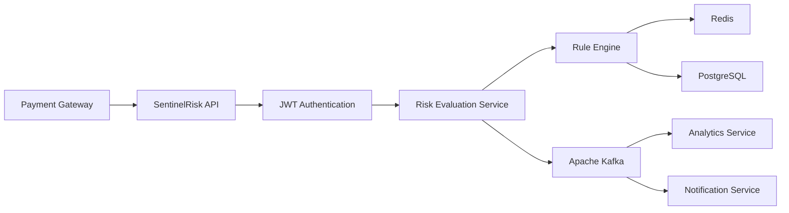
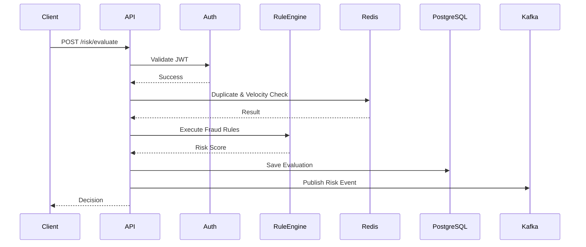
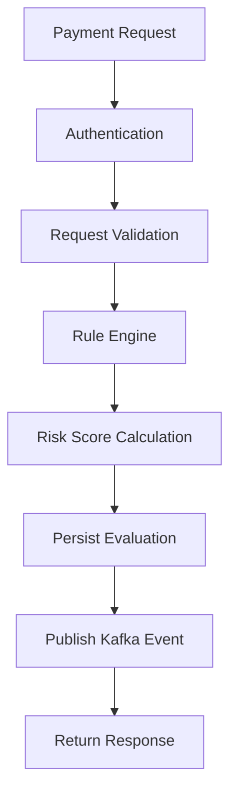

# High-Level Design (HLD)

> **Project:** SentinelRisk – Payment Risk Assessment & Fraud Detection Engine
> **Version:** 1.0
> **Status:** Draft

---

# 1. Overview

SentinelRisk is a backend microservice responsible for evaluating payment requests before authorization. It analyzes each request using configurable fraud detection rules and determines whether the payment should be:

* ✅ APPROVED
* ⚠️ MANUAL_REVIEW
* ❌ REJECTED

The service is designed using Clean Architecture principles and integrates with PostgreSQL, Redis, and Apache Kafka to provide a scalable, secure, and production-ready solution.

---

# 2. Goals

### Functional Goals

* Evaluate incoming payment requests.
* Detect suspicious transactions.
* Generate a risk score.
* Return a decision.
* Publish evaluation events.

### Non-Functional Goals

* Response time < 150ms
* Stateless architecture
* Horizontal scalability
* Secure by design
* Highly observable
* Easy to extend with new fraud rules

---

# 3. High-Level Architecture

---

# 4. System Components

| Component               | Responsibility                                |
| ----------------------- | --------------------------------------------- |
| REST API                | Receives payment evaluation requests          |
| Authentication          | Validates JWT tokens                          |
| Risk Evaluation Service | Coordinates the evaluation workflow           |
| Rule Engine             | Executes fraud detection rules                |
| Redis                   | Velocity checks, duplicate detection, caching |
| PostgreSQL              | Stores evaluation history and audit records   |
| Kafka                   | Publishes asynchronous events                 |
| Analytics Service       | Consumes events for reporting                 |
| Notification Service    | Sends alerts for suspicious transactions      |

---

# 5. Request Flow

---

# 6. Risk Evaluation Workflow

The Rule Engine evaluates multiple fraud indicators.

* Merchant Validation
* Device Validation
* Blacklist Check
* Velocity Check
* Transaction Amount Check
* Geo-location Check
* Duplicate Transaction Detection

Each rule contributes to a cumulative risk score.

| Risk Score | Decision      |
| ---------- | ------------- |
| 0–39       | APPROVED      |
| 40–69      | MANUAL_REVIEW |
| 70–100     | REJECTED      |

---

# 7. Technology Stack

| Layer      | Technology                         |
| ---------- | ---------------------------------- |
| Language   | Java 21                            |
| Framework  | Spring Boot 3                      |
| Security   | Spring Security + JWT              |
| Database   | PostgreSQL                         |
| Cache      | Redis                              |
| Messaging  | Apache Kafka                       |
| Build Tool | Maven                              |
| Migration  | Flyway                             |
| Monitoring | Micrometer + Prometheus + Grafana  |
| Logging    | Logback + MDC                      |
| Testing    | JUnit 5 + Mockito + Testcontainers |
| Deployment | Docker Compose                     |

---

# 8. Data Flow

---

# 9. Security Design

The system follows a **Secure by Default** approach.

* JWT Authentication
* Role-Based Access Control (RBAC)
* BCrypt password hashing
* AES-256 encryption for sensitive fields
* HTTPS communication
* Input validation
* Secure configuration using environment variables
* No sensitive information logged

---

# 10. Scalability Strategy

The application is designed to scale horizontally.

### Application

* Stateless Spring Boot instances
* Load balancer support

### Redis

* Distributed cache
* Velocity tracking
* Duplicate detection

### Kafka

* Topic partitioning
* Consumer groups
* Independent downstream services

### PostgreSQL

* Connection pooling
* Proper indexing
* Read replicas (future)

---

# 11. Failure Handling

| Failure              | Strategy                                                |
| -------------------- | ------------------------------------------------------- |
| Redis unavailable    | Fallback where possible and log degraded mode           |
| Kafka unavailable    | Retry with exponential backoff (Outbox Pattern planned) |
| Database unavailable | Return HTTP 503 and avoid partial processing            |
| Invalid JWT          | Return HTTP 401                                         |
| Validation failure   | Return HTTP 400                                         |

---

# 12. Observability

The service provides production-grade observability.

### Metrics

* Request count
* Response time
* Error rate
* Kafka publish count
* Redis hit ratio

### Logging

Each request contains:

* Correlation ID
* Trace ID
* Execution time
* Risk decision

### Monitoring

* Spring Boot Actuator
* Prometheus
* Grafana dashboards

---

# 13. Design Decisions

| Decision           | Reason                                         |
| ------------------ | ---------------------------------------------- |
| PostgreSQL         | ACID transactions and reliable persistence     |
| Redis              | Fast lookups for velocity and duplicate checks |
| Kafka              | Loose coupling and asynchronous processing     |
| Stateless Service  | Easy horizontal scaling                        |
| Clean Architecture | Better maintainability and testability         |

---

# 14. Future Enhancements

* Dynamic Rule Management
* Machine Learning Fraud Detection
* Device Fingerprinting
* Event Sourcing
* CQRS
* Kubernetes Deployment
* Multi-region support

---

# 15. Key Takeaways

SentinelRisk is designed as a production-ready backend service that demonstrates:

* Clean Architecture
* Distributed system fundamentals
* Event-driven communication
* Secure API design
* Scalable infrastructure
* Production observability
* Enterprise-grade coding practices

The architecture intentionally separates business logic from infrastructure, making the system easy to maintain, test, and extend while remaining suitable for high-throughput fintech workloads.
