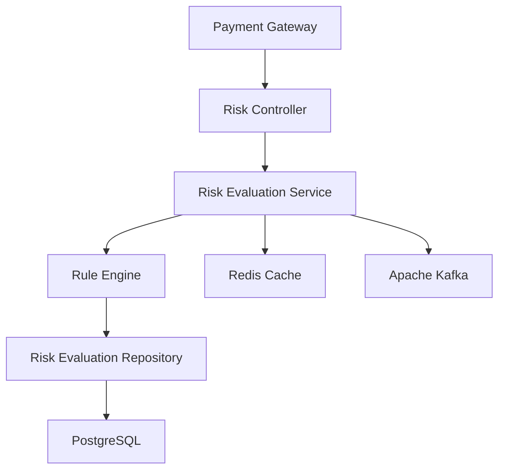
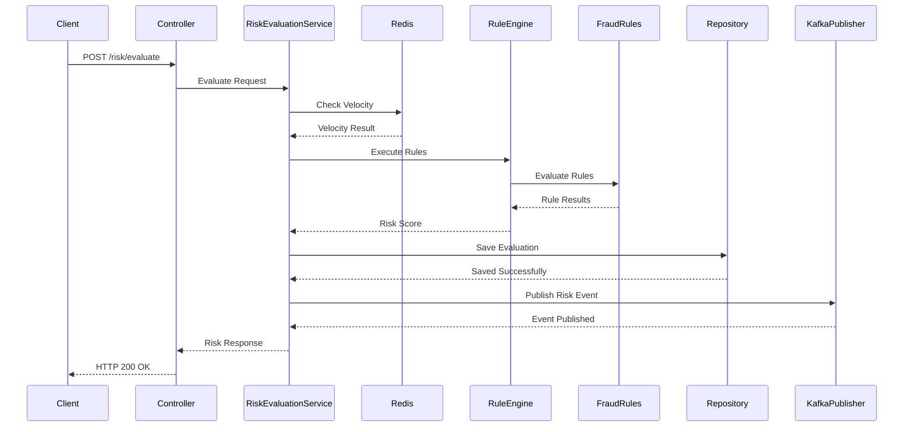
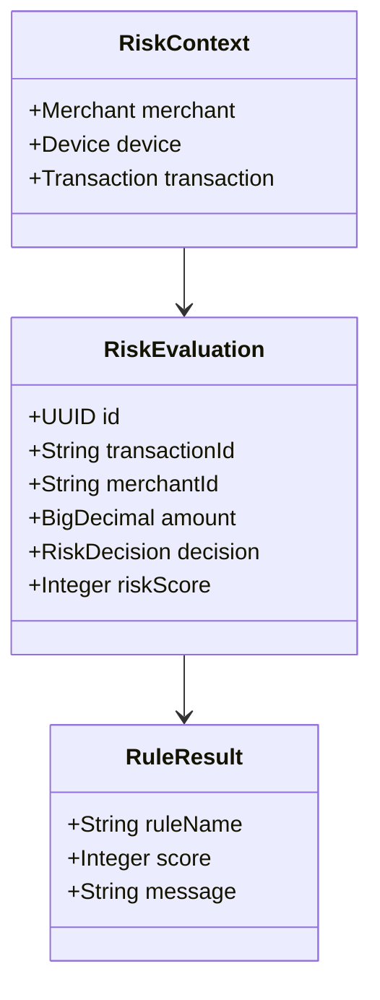

# Low-Level Design (LLD)

> **Project:** SentinelRisk – Payment Risk Assessment & Fraud Detection Engine
> **Version:** 1.0
> **Status:** Draft

---

# 1. Overview

This document describes the internal design of SentinelRisk, including module responsibilities, package organization, request processing, class interactions, and design patterns.

The implementation follows **Clean Architecture**, **SOLID principles**, and **Domain-Driven Design (DDD)** concepts to ensure maintainability, extensibility, and testability.

---

# 2. Package Structure

```text
src/main/java/com/sentinelrisk

├── config/
├── security/
├── controller/
├── dto/
│   ├── request/
│   └── response/
├── service/
├── domain/
│   ├── entity/
│   ├── model/
│   └── rule/
├── repository/
├── mapper/
├── validator/
├── exception/
├── kafka/
├── redis/
├── audit/
├── metrics/
└── common/
```

---

# 3. Layered Architecture



Each layer has a single responsibility.

| Layer      | Responsibility                  |
| ---------- | ------------------------------- |
| Controller | HTTP request/response handling  |
| Service    | Business workflow orchestration |
| Domain     | Fraud rules and business logic  |
| Repository | Database interaction            |
| Redis      | Cache and velocity tracking     |
| Kafka      | Event publishing                |

---

# 4. Core Components

## RiskController

Responsibilities:

* Expose REST endpoints
* Validate request body
* Delegate to service layer
* Return standardized responses

---

## RiskEvaluationService

Responsibilities:

* Coordinate the evaluation workflow
* Execute validation
* Invoke fraud rules
* Persist evaluation
* Publish Kafka events

---

## RuleEngine

Responsibilities:

* Execute fraud rules
* Aggregate rule results
* Calculate risk score
* Generate final decision

The RuleEngine should not contain business rules directly.

Instead, it delegates to individual rule implementations.

---

## Rule Interface

```java
public interface FraudRule {

    RuleResult evaluate(RiskContext context);

}
```

Each rule implements this interface.

Examples:

* HighAmountRule
* VelocityRule
* BlacklistRule
* DeviceRule
* CountryRule

This follows the **Strategy Pattern** and makes new rules easy to add without modifying existing code.

---

## Repository Layer

Repositories are responsible only for persistence.

Example:

```text
RiskEvaluationRepository

MerchantRepository

AuditRepository
```

Business logic must never exist inside repositories.

---

## Kafka Publisher

Responsibilities:

* Publish RiskEvaluated events
* Serialize payload
* Attach Correlation ID
* Handle transient failures

---

## Redis Service

Responsibilities:

* Duplicate transaction detection
* Velocity counters
* Merchant cache
* Blacklist cache

---

# 5. Request Processing



---

# 6. Domain Model



---

# 7. Design Patterns

| Pattern    | Usage                   |
| ---------- | ----------------------- |
| Strategy   | Fraud rules             |
| Builder    | Response objects        |
| Factory    | Rule creation (future)  |
| Repository | Persistence abstraction |
| DTO        | API request/response    |
| Singleton  | Spring-managed beans    |

---

# 8. Exception Handling

All exceptions are handled centrally.

```text
Controller

↓

Service

↓

GlobalExceptionHandler

↓

ErrorResponse
```

Example response:

```json
{
  "status": 400,
  "error": "VALIDATION_ERROR",
  "message": "Merchant ID is mandatory",
  "traceId": "abc123"
}
```

---

# 9. Validation

Request validation is performed using Jakarta Bean Validation.

Examples:

* @NotNull
* @NotBlank
* @Positive
* @Email
* @Pattern

Business validation remains inside the service layer.

---

# 10. Logging

Every request contains:

* Correlation ID
* Trace ID
* Execution Time
* Request URI
* HTTP Status
* Risk Decision

Sensitive information is masked before logging.

---

# 11. Transaction Flow

```text
Authenticate

↓

Validate

↓

Duplicate Check

↓

Velocity Check

↓

Rule Evaluation

↓

Persist

↓

Publish Event

↓

Return Response
```

---

# 12. Dependency Rules

Allowed dependencies:

```text
Controller

↓

Service

↓

Domain

↓

Repository
```

Forbidden:

* Controller → Repository
* Repository → Controller
* Kafka → Controller
* Redis → Controller
* Entity → DTO

This keeps the architecture loosely coupled.

---

# 13. Future Extensibility

The design allows new capabilities to be introduced with minimal changes.

Examples:

* ML-based Fraud Rule
* Dynamic Rule Configuration
* Rule Versioning
* Event Sourcing
* Multi-tenant Support

---

# 14. Design Decisions

| Decision                       | Reason                   |
| ------------------------------ | ------------------------ |
| Clean Architecture             | Separation of concerns   |
| Strategy Pattern               | Extensible fraud rules   |
| DTO Pattern                    | Prevent entity exposure  |
| Repository Pattern             | Database abstraction     |
| Centralized Exception Handling | Consistent API responses |

---

# 15. Key Takeaways

The low-level design emphasizes modularity, maintainability, and extensibility. By separating orchestration, business rules, persistence, and infrastructure concerns, SentinelRisk can evolve as new fraud detection capabilities are introduced without significant changes to the core architecture.

The Strategy Pattern ensures fraud rules remain independently testable, while Clean Architecture keeps the business domain isolated from framework-specific implementation details.
