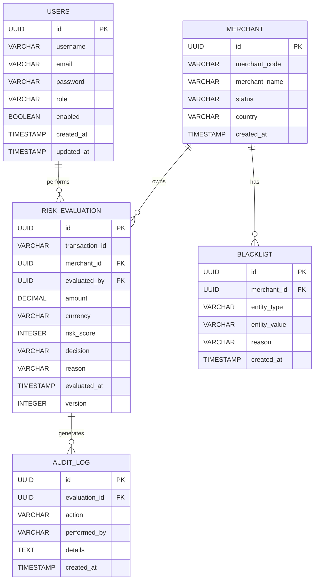

# Database Design

> **Project:** SentinelRisk – Payment Risk Assessment & Fraud Detection Engine
> **Version:** 1.0
> **Database:** PostgreSQL 17

---

# 1. Overview

SentinelRisk uses PostgreSQL as its primary relational database.

The database is responsible for:

* Persisting risk evaluation results
* Maintaining audit history
* Managing application users
* Managing merchants
* Storing blacklist information
* Supporting future rule configuration

The database follows normalization principles while balancing read performance through appropriate indexing.

---

# 2. Design Principles

* UUID as primary key for distributed uniqueness
* ACID transactions
* Audit columns on all business tables
* Soft delete where business requires history
* Foreign key constraints for referential integrity
* Optimistic locking using version column
* Flyway for schema migrations

---

# 3. Entity Relationship Diagram



---

# 4. Tables

## 4.1 USERS

Purpose

Stores authenticated application users.

| Column     | Type         |
| ---------- | ------------ |
| id         | UUID         |
| username   | VARCHAR(100) |
| email      | VARCHAR(255) |
| password   | VARCHAR(255) |
| role       | VARCHAR(50)  |
| enabled    | BOOLEAN      |
| created_at | TIMESTAMP    |
| updated_at | TIMESTAMP    |

Indexes

* username (Unique)
* email (Unique)

---

## 4.2 MERCHANT

Purpose

Stores merchant information.

| Column        | Type         |
| ------------- | ------------ |
| id            | UUID         |
| merchant_code | VARCHAR(50)  |
| merchant_name | VARCHAR(255) |
| status        | VARCHAR(30)  |
| country       | VARCHAR(10)  |
| created_at    | TIMESTAMP    |
| updated_at    | TIMESTAMP    |

Indexes

* merchant_code (Unique)
* status

---

## 4.3 RISK_EVALUATION

Purpose

Stores every evaluated transaction.

| Column         | Type          |
| -------------- | ------------- |
| id             | UUID          |
| transaction_id | VARCHAR(100)  |
| merchant_id    | UUID          |
| evaluated_by   | UUID          |
| amount         | NUMERIC(18,2) |
| currency       | VARCHAR(3)    |
| risk_score     | INTEGER       |
| decision       | VARCHAR(30)   |
| reason         | TEXT          |
| evaluated_at   | TIMESTAMP     |
| version        | INTEGER       |

Indexes

* transaction_id (Unique)
* merchant_id
* evaluated_at
* decision
* risk_score

---

## 4.4 BLACKLIST

Purpose

Stores blocked entities.

Supported types

* CUSTOMER
* DEVICE
* IP
* MERCHANT

| Column       | Type         |
| ------------ | ------------ |
| id           | UUID         |
| merchant_id  | UUID         |
| entity_type  | VARCHAR(30)  |
| entity_value | VARCHAR(255) |
| reason       | TEXT         |
| created_at   | TIMESTAMP    |

Indexes

* entity_type
* entity_value

---

## 4.5 AUDIT_LOG

Purpose

Stores immutable audit events.

| Column        | Type         |
| ------------- | ------------ |
| id            | UUID         |
| evaluation_id | UUID         |
| action        | VARCHAR(100) |
| performed_by  | VARCHAR(100) |
| details       | TEXT         |
| created_at    | TIMESTAMP    |

Indexes

* evaluation_id
* created_at

---

# 5. Relationships

| Parent          | Child           | Relationship |
| --------------- | --------------- | ------------ |
| Merchant        | Risk Evaluation | One-to-Many  |
| User            | Risk Evaluation | One-to-Many  |
| Merchant        | Blacklist       | One-to-Many  |
| Risk Evaluation | Audit Log       | One-to-Many  |

---

# 6. Primary Keys

All tables use UUID.

Reason:

* Globally unique
* Better suited for distributed systems
* Avoids sequence collisions
* Easier data migration

---

# 7. Foreign Keys

| Table           | Foreign Key   |
| --------------- | ------------- |
| risk_evaluation | merchant_id   |
| risk_evaluation | evaluated_by  |
| blacklist       | merchant_id   |
| audit_log       | evaluation_id |

---

# 8. Indexing Strategy

| Table           | Index                     |
| --------------- | ------------------------- |
| users           | username, email           |
| merchant        | merchant_code             |
| risk_evaluation | transaction_id            |
| risk_evaluation | merchant_id               |
| risk_evaluation | evaluated_at              |
| risk_evaluation | decision                  |
| blacklist       | entity_type, entity_value |
| audit_log       | evaluation_id             |

---

# 9. Audit Columns

Every business table contains:

* created_at
* updated_at

Critical business entities additionally maintain:

* version (Optimistic Locking)

---

# 10. Optimistic Locking

RiskEvaluation uses a version column.

Benefits

* Prevents lost updates
* Improves concurrency
* No pessimistic database locks

---

# 11. Constraints

Examples

* transaction_id UNIQUE
* merchant_code UNIQUE
* username UNIQUE
* email UNIQUE
* amount > 0
* risk_score BETWEEN 0 AND 100

---

# 12. Flyway Migration Strategy

Migration naming convention:

```text
V1__create_users.sql
V2__create_merchants.sql
V3__create_risk_evaluation.sql
V4__create_blacklist.sql
V5__create_audit_log.sql
```

Schema changes must always be applied through Flyway.

---

# 13. Future Tables

The following tables are intentionally excluded from Version 1:

* FRAUD_RULE
* RULE_VERSION
* DEVICE_PROFILE
* GEO_LOCATION
* ML_PREDICTION
* EVENT_OUTBOX

These will be introduced as the project evolves.

---

# 14. Design Decisions

| Decision           | Reason                               |
| ------------------ | ------------------------------------ |
| PostgreSQL         | ACID guarantees and mature ecosystem |
| UUID PK            | Distributed-friendly identifiers     |
| Flyway             | Version-controlled schema            |
| Audit Table        | Immutable history                    |
| Optimistic Locking | Safe concurrent updates              |

---

# 15. Future Enhancements

* Table partitioning for risk evaluations
* Read replicas
* Outbox table for reliable Kafka publishing
* JSONB columns for flexible rule metadata
* Archival strategy for historical evaluations

---

# 16. Summary

The database design focuses on consistency, auditability, and scalability while keeping the initial schema intentionally small. The design provides a solid foundation for future enhancements such as dynamic fraud rules, event sourcing, and machine learning without requiring significant schema redesign.
