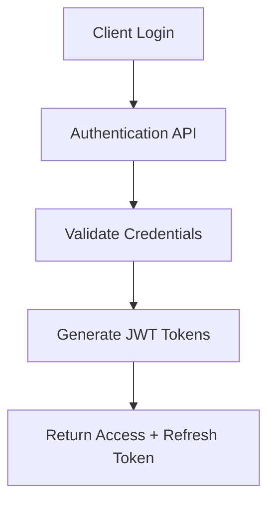
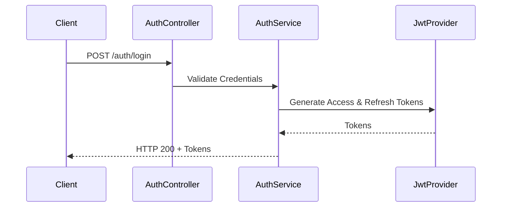

# Security Architecture

> **Project:** SentinelRisk – Payment Risk Assessment & Fraud Detection Engine
> **Version:** 1.0
> **Status:** Draft

---

# Table of Contents

1. Overview
2. Security Principles
3. Authentication
4. Authorization
5. JWT Token Strategy
6. Password Security
7. Data Encryption
8. API Security
9. Secure Headers
10. Rate Limiting
11. Idempotency
12. Secret Management
13. Logging & Auditing
14. Security Best Practices
15. Future Enhancements

---

# 1. Overview

SentinelRisk is designed following a **Security by Design** approach. Security is considered at every layer of the application—from authentication and authorization to data encryption, API protection, and operational monitoring.

The primary objectives are:

* Protect sensitive financial data.
* Prevent unauthorized access.
* Ensure secure communication.
* Maintain auditability.
* Minimize common web application vulnerabilities.

---

# 2. Security Principles

The application follows these principles:

* Least Privilege Access
* Defense in Depth
* Secure by Default
* Fail Secure
* Zero Trust between clients and services
* Complete Auditability

---

# 3. Authentication

SentinelRisk uses **JWT-based authentication**.

Authentication flow:



### Token Types

| Token         | Purpose                   | Expiry     |
| ------------- | ------------------------- | ---------- |
| Access Token  | Access protected APIs     | 15 Minutes |
| Refresh Token | Generate new access token | 7 Days     |

---

# 4. Authorization

Role-Based Access Control (RBAC) is used.

Supported Roles:

| Role         | Permissions                        |
| ------------ | ---------------------------------- |
| ADMIN        | Full Access                        |
| RISK_ANALYST | View Evaluations, Manage Blacklist |
| MERCHANT     | Evaluate Transactions              |
| SYSTEM       | Internal Service Communication     |

Example:

| API                       | Required Role |
| ------------------------- | ------------- |
| POST /risk/evaluate       | MERCHANT      |
| POST /blacklist           | ADMIN         |
| DELETE /blacklist/{id}    | ADMIN         |
| GET /risk/{transactionId} | RISK_ANALYST  |

---

# 5. JWT Token Strategy

### Access Token

Contains:

* User ID
* Username
* Role
* Issued Time
* Expiration Time

### Refresh Token

Used only to obtain a new Access Token.

Refresh Tokens are rotated after each successful refresh to reduce the impact of token theft.

---

## Authentication Flow



---

# 6. Password Security

Passwords are **never stored in plain text**.

### Algorithm

* BCrypt

### Why BCrypt?

* Adaptive hashing
* Built-in salt
* Resistant to rainbow table attacks
* Industry standard for password storage

Password requirements:

* Minimum 8 characters
* At least one uppercase letter
* One lowercase letter
* One digit
* One special character

---

# 7. Data Encryption

Sensitive information is encrypted before persistence.

### Encryption at Rest

Algorithm:

* AES-256

Examples:

* Email (optional based on business needs)
* Device Identifier
* IP Address (if retained)
* Other sensitive identifiers

### Encryption in Transit

* HTTPS only
* TLS 1.2 or above

---

# 8. API Security

All protected endpoints require:

```http
Authorization: Bearer <access-token>
Content-Type: application/json
Accept: application/json
X-Correlation-Id: <UUID>
```

Financial operations additionally require:

```http
Idempotency-Key: <UUID>
```

Input validation is enforced using Jakarta Bean Validation.

Examples:

* @NotBlank
* @Email
* @Positive
* @Pattern

---

# 9. Secure Headers

Recommended HTTP response headers:

```http
Cache-Control: no-store
Pragma: no-cache
X-Content-Type-Options: nosniff
X-Frame-Options: DENY
Referrer-Policy: no-referrer
Permissions-Policy: geolocation=()
Content-Security-Policy: default-src 'self'
```

---

# 10. Rate Limiting

To reduce abuse and brute-force attacks:

| API             | Limit                     |
| --------------- | ------------------------- |
| Login           | 5 requests/minute/IP      |
| Refresh Token   | 10 requests/minute/User   |
| Risk Evaluation | Configurable per Merchant |

Implementation (future):

* Redis-based rate limiting
* Sliding Window algorithm

---

# 11. Idempotency

Financial APIs support idempotent processing.

Clients provide:

```http
Idempotency-Key: 550e8400-e29b-41d4-a716-446655440000
```

If the same key is received again, the original response is returned instead of processing the request again.

---

# 12. Secret Management

Secrets must never be committed to source control.

Configuration sources:

* Environment Variables
* Docker Secrets (future)
* Kubernetes Secrets (future)

Examples:

* JWT Secret
* Database Password
* Kafka Credentials
* Redis Password

---

# 13. Logging & Auditing

Each request logs:

* Correlation ID
* Trace ID
* User ID
* API Path
* Response Status
* Execution Time

Sensitive information is never logged.

Do **not** log:

* Passwords
* JWT Tokens
* Refresh Tokens
* Encryption Keys

Audit records capture:

* User
* Action
* Timestamp
* Outcome

---

# 14. Security Best Practices

The application follows these practices:

* Stateless authentication
* Password hashing with BCrypt
* HTTPS everywhere
* Input validation
* Principle of Least Privilege
* Centralized exception handling
* Secure HTTP headers
* Token expiration
* Refresh token rotation
* Structured logging

---

# 15. Future Enhancements

Future improvements include:

* Multi-Factor Authentication (MFA)
* OAuth2/OpenID Connect integration
* Token revocation list
* Device fingerprinting
* IP reputation checks
* Web Application Firewall (WAF)
* Mutual TLS (mTLS) for service-to-service communication

---

# Security Summary

| Area               | Technology                       |
| ------------------ | -------------------------------- |
| Authentication     | JWT                              |
| Authorization      | RBAC                             |
| Password Hashing   | BCrypt                           |
| Data Encryption    | AES-256                          |
| Transport Security | HTTPS / TLS 1.2+                 |
| Validation         | Jakarta Bean Validation          |
| Rate Limiting      | Redis (Planned)                  |
| Logging            | Structured JSON + Correlation ID |
| Secrets            | Environment Variables            |

---

# Key Design Decisions

* **JWT** is used to keep services stateless and simplify horizontal scaling.
* **Access + Refresh Token** strategy balances usability with security.
* **BCrypt** is chosen because passwords must be hashed, not encrypted.
* **AES-256** protects sensitive data stored in the database.
* **Idempotency-Key** prevents duplicate financial operations during retries.
* **Structured logging** improves incident investigation without exposing sensitive data.
